# ChatApp Project Documentation (Report Format)

## 1. Project Title
**ChatApp - Full Stack Real-Time Messaging Platform**

---

## 2. Objective
The objective of this project is to build a secure and scalable real-time chat application that supports:
- user authentication with session management,
- one-to-one and group communication,
- role-based access control,
- live events such as typing, presence, and calls.

The system is designed to provide a smooth user experience similar to modern chat applications while following clean architectural practices.

---

## 3. Technology Stack

### Frontend
- React (Vite)
- React Router
- Context API for global state
- Fetch API with token-aware wrapper

### Backend
- Node.js
- Express.js
- Socket.IO
- JWT authentication

### Database and Infrastructure
- MongoDB (persistent data)
- Redis (rate limiting and presence)
- Background workers (expiry, scan, notifications)

---

## 4. High-Level Architecture
The project follows a layered architecture:

1. **Presentation Layer (Frontend):**
   - Renders pages and protected routes.
   - Manages login state and theme.
   - Connects to REST and socket endpoints.

2. **Application/API Layer (Backend):**
   - Exposes REST endpoints for auth, users, channels, and messages.
   - Manages real-time socket events for chat and calls.
   - Applies security controls (auth checks, sanitization, rate limiting).

3. **Data Layer:**
   - MongoDB stores users, sessions, messages, groups, and call data.
   - Redis tracks online presence and controls request/message rate.

This structure helps keep code modular, maintainable, and production-ready.

---

## 5. Frontend Main Code (Core Parts)

### 5.1 Application Bootstrap (`frontend/src/main.jsx`)
This is the frontend entry point where the app is mounted and wrapped with router and context.

```jsx
import React from 'react'
import ReactDOM from 'react-dom/client'
import { BrowserRouter } from 'react-router-dom'
import { AppProvider } from './context/AppContext.jsx'
import App from './App.jsx'
import './index.css'

ReactDOM.createRoot(document.getElementById('root')).render(
  <React.StrictMode>
    <BrowserRouter
      future={{
        v7_startTransition: true,
        v7_relativeSplatPath: true,
      }}
    >
      <AppProvider>
        <App />
      </AppProvider>
    </BrowserRouter>
  </React.StrictMode>,
)
```

### 5.2 Route and Access Control (`frontend/src/App.jsx`)
This file controls major routes and protects pages using wrappers like `ProtectedRoute`, `GuestRoute`, and `AdminRoute`.

```jsx
<Routes>
  <Route path="/" element={<HomeGate />} />
  <Route path="/login" element={<GuestRoute><Login /></GuestRoute>} />
  <Route path="/register" element={<GuestRoute><Register /></GuestRoute>} />
  <Route path="/mfa" element={<GuestRoute><Mfa /></GuestRoute>} />
  <Route path="/welcome" element={<ProtectedRoute><Welcome /></ProtectedRoute>} />
  <Route path="/chat" element={<ProtectedRoute><Chat /></ProtectedRoute>} />
  <Route path="/admin/audit-logs" element={<AdminRoute><AdminAuditLogs /></AdminRoute>} />
  <Route path="/settings/linked-devices" element={<ProtectedRoute><LinkedDevices /></ProtectedRoute>} />
  <Route path="/group/join/:token" element={<ProtectedRoute><GroupInviteJoin /></ProtectedRoute>} />
  <Route path="/group/join-request/:groupId" element={<ProtectedRoute><GroupJoinRequest /></ProtectedRoute>} />
</Routes>
```

### 5.3 Global Session State (`frontend/src/context/AppContext.jsx`)
This context restores user session, fetches profile data, and exposes user state across the application.

```jsx
const refreshUser = useCallback(async () => {
  setUserLoading(true)
  try {
    await tryRestoreSession()
    if (!getAccessToken()) {
      setUser(null)
      return
    }
    const res = await apiRequest('/users/me')
    const data = await res.json().catch(() => ({}))
    if (res.ok) setUser(data)
    else {
      if (res.status === 401) clearSession()
      setUser(null)
    }
  } catch {
    setUser(null)
  } finally {
    setUserLoading(false)
  }
}, [])
```

### 5.4 Token Refresh Strategy (`frontend/src/lib/session.js`)
The frontend retries failed authorized requests by rotating access token through refresh flow.

```js
export async function apiRequest(path, options = {}) {
  const url = path.startsWith('http') ? path : `${config.apiBaseUrl}${path}`
  let response = await doFetch(url, options, getAccessToken())
  if (response.status !== 401) return response

  const newToken = await refreshAccessTokenOnce()
  if (!newToken) return response

  return doFetch(url, options, newToken)
}
```

---

## 6. Backend Main Code (Core Parts)

### 6.1 Express App Setup (`backend/src/expressApp.js`)
This module initializes middleware and registers route groups.

```js
const app = express()

app.use(helmet({ contentSecurityPolicy: false }))
app.use(cors({ origin: allowCorsOrigin, credentials: true }))
app.use(express.json({ limit: '1mb' }))

app.get('/health', (_req, res) => res.status(200).json({ status: 'ok' }))

app.use('/auth', authRoutes)
app.use('/users', userRoutes)
app.use('/channels', channelRoutes)
app.use('/conversations', conversationRoutes)
app.use('/admin', adminRoutes)
```

### 6.2 Server + Socket.IO Runtime (`backend/src/index.js`)
This is the main backend entry point that creates HTTP server, binds Socket.IO, and starts workers.

```js
const httpServer = http.createServer(app)
const io = new SocketIOServer(httpServer, {
  cors: { origin: allowCorsOrigin, credentials: true },
})

app.set('io', io)

io.on('connection', (socket) => {
  socket.on('auth:resume', (token, cb) => {
    const user = getUserFromToken(token)
    if (!user) return cb?.({ ok: false, error: 'Invalid or expired token' })
    socket.data.user = user
    socket.join(`user:${user.id}`)
    cb?.({ ok: true, user: { id: user.id, role: user.role } })
  })
})
```

### 6.3 Authentication and Session Lifecycle (`backend/src/auth/authRoutes.js`)
Auth routes implement register, login, MFA verification, refresh token rotation, logout, and session revoke.

```js
router.post('/login', async (req, res) => {
  const { email, password } = req.body || {}
  const user = await getUserWithPassword(email)
  const passwordMatch = user && await bcrypt.compare(password, user.passwordHash)
  if (!passwordMatch) return res.status(401).json({ error: 'Invalid credentials' })

  if (user.mfaEnabled) {
    const tempToken = generateAccessToken({ sub: String(user._id), role: user.role, mfaPending: true })
    return res.status(200).json({ requiresMfa: true, tempToken })
  }

  const tokens = await createSessionAndTokens(user, getClientInfo(req))
  return res.status(200).json(tokens)
})
```

### 6.4 Protected Route Middleware (`backend/src/middleware/auth.js`)
This middleware verifies JWT and rejects MFA-pending tokens for protected APIs.

```js
function requireAuth(req, res, next) {
  const authHeader = req.headers.authorization
  const token = authHeader?.startsWith('Bearer ') ? authHeader.slice(7) : null
  if (!token) return res.status(401).json({ error: 'Authorization required' })

  const decoded = verifyToken(token)
  if (decoded.mfaPending) return res.status(401).json({ error: 'Complete MFA verification first' })

  req.user = { id: decoded.sub, role: decoded.role || 'guest', mfaEnabled: !!decoded.mfaEnabled }
  next()
}
```

---

## 7. Working Flow of the System

1. User opens frontend and session restore runs automatically.
2. User logs in (and verifies MFA when enabled).
3. Frontend stores refresh token and in-memory access token.
4. Protected API calls include Bearer token.
5. On token expiry, `/auth/refresh` is called and request is retried.
6. Socket connection uses `auth:resume` to authenticate and join personal/channel rooms.
7. Messages, typing status, presence, and call signals are exchanged in real time.

---

## 8. Security and Reliability Features
- JWT-based authentication with short-lived access token.
- Refresh token rotation with session tracking.
- Role-based route protection on frontend and backend.
- Request and event rate limiting through Redis.
- Message sanitization before persistence.
- Audit logging for sensitive auth and admin events.
- Feature flags for modular rollout of calls/stories/notifications.

---

## 9. Feature-wise Main Code (Frontend + Backend)

### 9.1 Authentication & MFA
- **Frontend code chunk (`frontend/src/lib/session.js`)**
```js
export async function apiRequest(path, options = {}) {
  const url = path.startsWith('http') ? path : `${config.apiBaseUrl}${path}`
  let response = await doFetch(url, options, getAccessToken())
  if (response.status !== 401) return response

  const newToken = await refreshAccessTokenOnce()
  if (!newToken) return response
  return doFetch(url, options, newToken)
}
```
- **Backend code chunk (`backend/src/auth/authRoutes.js`)**
```js
router.post('/login', async (req, res) => {
  const { email, password } = req.body || {}
  const user = await getUserWithPassword(email)
  const passwordMatch = user && await bcrypt.compare(password, user.passwordHash)
  if (!passwordMatch) return res.status(401).json({ error: 'Invalid credentials' })

  if (user.mfaEnabled) {
    const tempToken = generateAccessToken({ sub: String(user._id), role: user.role, mfaPending: true })
    return res.status(200).json({ requiresMfa: true, tempToken })
  }

  const tokens = await createSessionAndTokens(user, getClientInfo(req))
  return res.status(200).json({ accessToken: tokens.accessToken, refreshToken: tokens.refreshToken })
})
```
- **Explanation**: frontend retries with refresh token when access token expires; backend handles login, optional MFA challenge, and token/session issuance.

### 9.2 One-to-One Chat & Realtime Messaging
- **Frontend code chunk (`frontend/src/pages/Chat.jsx`)**
```jsx
useEffect(() => {
  connectSocket()
  if (activeChannel?._id && chatUnlocked) {
    if (activeChannel.type === 'group') joinGroup(activeChannel._id)
    else joinChannel(activeChannel._id)
  }
}, [activeChannel?._id, activeChannel?.type, chatUnlocked])

useEffect(() => {
  const socket = connectSocket()
  if (!socket) return
  socket.on('message:new', handleMessageNew)
  socket.on('typing:update', handleTypingUpdate)
  socket.on('message:read', handleMessageRead)
}, [activeChannel, chatUnlocked])
```
- **Backend code chunk (`backend/src/index.js`)**
```js
socket.on('message:send', async (payload, cb) => {
  const { channelId, content } = payload || {}
  await ensureChannelMember(user.id, channelId)
  await ensureChannelCanPost(user.id, channelId)
  const sanitizedContent = sanitizeMessageContent(content)
  const message = await Message.create({ channel: channelId, sender: user.id, content: sanitizedContent })
  io.to(`channel:${channelId}`).emit('message:new', {
    id: String(message._id), channel: String(message.channel), sender: String(message.sender), content: message.content,
  })
  cb?.({ ok: true })
})
```
- **Explanation**: frontend joins room + listens for live events; backend validates message and broadcasts to all members in the room.

### 9.3 Group Chat, Invites, and Join Requests
- **Frontend code chunk (`frontend/src/pages/GroupJoinRequest.jsx`)**
```jsx
const res = await apiRequest(`/group/${groupId}/join-request`, {
  method: 'POST',
  headers: { 'Content-Type': 'application/json' },
})
const data = await res.json().catch(() => ({}))
if (!res.ok) throw new Error(data.error || 'Failed to request to join')
setStatus(data.status || 'requested')
```
- **Backend code chunk (`backend/src/routes/groupRoutes.js`)**
```js
router.post('/group/join-by-link', async (req, res) => {
  const { token } = req.body || {}
  const existing = await GroupInviteLink.findOne({ token }).lean().exec()
  if (!existing) return res.status(404).json({ error: 'Invite token not found' })

  const group = await findGroupOr404(String(existing.groupId))
  const membership = await ChannelMember.findOne({ channel: group._id, user: req.user.id }).lean().exec()
  if (!membership) await ChannelMember.create({ channel: group._id, user: req.user.id, isAdmin: false, canPost: true })

  return res.status(200).json({ ok: true, status: membership ? 'already_member' : 'joined', groupId: String(group._id) })
})
```
- **Explanation**: invite token or join-request flow is controlled on frontend; backend verifies token/policy, then either adds membership directly or creates a pending request.

### 9.4 Stories (Status Updates)
- **Frontend code chunk (`frontend/src/components/StoryTray.jsx`)**
```jsx
const refresh = async () => {
  const res = await apiRequest('/stories/feed?limit=50')
  const data = await res.json().catch(() => ({}))
  if (!res.ok) throw new Error(data.error || 'Failed to fetch stories')
  setStories(Array.isArray(data.stories) ? data.stories : [])
}
```
- **Backend code chunk (`backend/src/routes/storyRoutes.js`)**
```js
router.post('/stories', async (req, res) => {
  const userId = req.user.id
  const { content, expiresInMinutes, privacy } = req.body || {}
  const sanitizedContent = sanitizeStoryContent(content)
  const ttlMinutes = Number.isFinite(Number(expiresInMinutes)) ? Number(expiresInMinutes) : 24 * 60
  const expiresAt = new Date(Date.now() + ttlMinutes * 60 * 1000)
  const audienceType = privacy?.audienceType === 'whitelist' ? 'whitelist' : 'everyone'
  const story = await Story.create({ authorId: userId, kind: 'text', content: sanitizedContent, expiresAt, privacy: { audienceType } })
  return res.status(201).json({ id: String(story._id) })
})
```
- **Explanation**: frontend shows story feed/composer; backend sanitizes content, sets TTL, enforces privacy, and stores story document.

### 9.5 Notifications (In-App + Web Push)
- **Frontend code chunk (`frontend/src/components/NotificationBell.jsx`)**
```jsx
useEffect(() => {
  if (!hasAuth) return
  void refreshUnread()
  const id = window.setInterval(() => void refreshUnread(), 30000)
  return () => window.clearInterval(id)
}, [hasAuth])

useEffect(() => {
  if (!hasAuth) return
  void ensureWebPushSubscription({ apiRequest, enqueueToast })
}, [hasAuth])
```
- **Backend code chunk (`backend/src/routes/notificationRoutes.js`)**
```js
router.get('/notifications', async (req, res) => {
  const userId = req.user.id
  const unreadOnly = req.query.unreadOnly !== 'false'
  const query = { userId, ...(unreadOnly ? { readAt: null } : {}) }
  const notifications = await NotificationInbox.find(query).sort({ createdAt: -1 }).limit(100).lean().exec()
  return res.status(200).json({ notifications })
})
```
- **Explanation**: frontend polls unread notifications and registers push subscription; backend stores subscription and returns per-user inbox data.

### 9.6 Voice/Video Calls
- **Frontend code chunk (`frontend/src/components/CallModal.jsx`)**
```jsx
const stream = await navigator.mediaDevices.getUserMedia({ audio: true, video: callType === 'video' })
for (const track of stream.getTracks()) pc.addTrack(track, stream)

socketRef.current.emit('call:invite', {
  calleeId: String(dmOtherMember.id),
  callType,
  conversationId: String(activeChannel._id),
  offer: pc.localDescription,
}, (res) => {
  if (!res?.ok || !res.callId) return
  setCallId(String(res.callId))
})
```
- **Backend code chunk (`backend/src/index.js`)**
```js
socket.on('call:invite', async (payload, cb) => {
  const call = await Call.create({
    callerId: user.id,
    calleeId: String(payload.calleeId),
    conversationId: payload.conversationId ? String(payload.conversationId) : null,
    callType: payload.callType,
    status: 'ringing',
    offer: payload.offer || null,
  })
  io.to(`user:${payload.calleeId}`).emit('call:invite', {
    callId: String(call._id), callerId: user.id, calleeId: String(payload.calleeId), callType: payload.callType, offer: payload.offer || null,
  })
  cb?.({ ok: true, callId: String(call._id) })
})
```
- **Explanation**: frontend establishes WebRTC peer connection and sends signaling payload; backend relays signaling and persists call lifecycle.

### 9.7 Linked Devices & Sessions
- **Frontend code chunk (`frontend/src/pages/LinkedDevices.jsx`)**
```jsx
const res = await apiRequest('/auth/sessions')
const data = await res.json().catch(() => ({}))
setSessions(Array.isArray(data.sessions) ? data.sessions : [])

await apiRequest(`/auth/sessions/${encodeURIComponent(sessionId)}`, {
  method: 'DELETE',
})
```
- **Backend code chunk (`backend/src/auth/authRoutes.js`)**
```js
router.get('/sessions', requireAuth, async (req, res) => {
  const sessions = await Session.find({ user: req.user.id }).sort({ createdAt: -1 }).lean().exec()
  return res.status(200).json({ sessions })
})

router.delete('/sessions/:sessionId', requireAuth, async (req, res) => {
  const session = await Session.findOne({ _id: req.params.sessionId, user: req.user.id }).exec()
  session.revokedAt = new Date()
  session.revokedReason = 'revoked'
  await session.save()
  return res.status(200).json({ ok: true })
})
```
- **Explanation**: each login session is tracked in MongoDB and can be revoked from the frontend for device-level sign-out.

### 9.8 Admin Audit Logs
- **Frontend code chunk (`frontend/src/pages/AdminAuditLogs.jsx`)**
```jsx
const params = new URLSearchParams()
params.set('limit', String(pageSize))
params.set('skip', String(page * pageSize))
const res = await apiRequest(`/admin/audit-logs?${params.toString()}`)
const data = await res.json().catch(() => ({}))
setLogs(Array.isArray(data.logs) ? data.logs : [])
setTotal(typeof data.total === 'number' ? data.total : 0)
```
- **Backend code chunk (`backend/src/routes/adminRoutes.js`)**
```js
router.use(requireAuth)
router.use(requireRole('admin'))

router.get('/audit-logs', async (req, res) => {
  const limit = Math.min(parseInt(req.query.limit, 10) || 50, 100)
  const skip = parseInt(req.query.skip, 10) || 0
  const logs = await AuditLog.find().sort({ createdAt: -1 }).skip(skip).limit(limit).lean().exec()
  const total = await AuditLog.countDocuments()
  return res.status(200).json({ logs, total, limit, skip })
})
```
- **Explanation**: frontend provides paginated filtering UI; backend restricts route to admins and returns security audit records.

---

## 10. Conclusion
This ChatApp project demonstrates a practical production-style implementation of a real-time communication platform.  
It combines secure authentication, modular REST APIs, and low-latency Socket.IO event handling with a clean React frontend architecture.  
The design is scalable, maintainable, and suitable for extension into larger enterprise or social communication systems.

---

## 11. UML Diagrams (Feature Flows)

### 11.1 Sign Up Flow (Sequence Diagram)
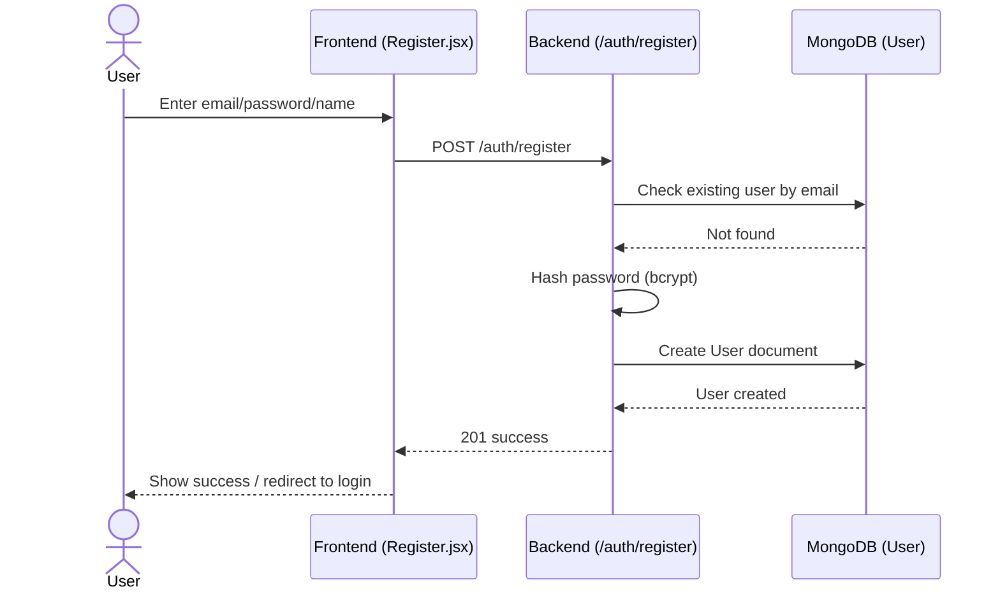

### 11.2 Sign In + MFA Flow (Sequence Diagram)
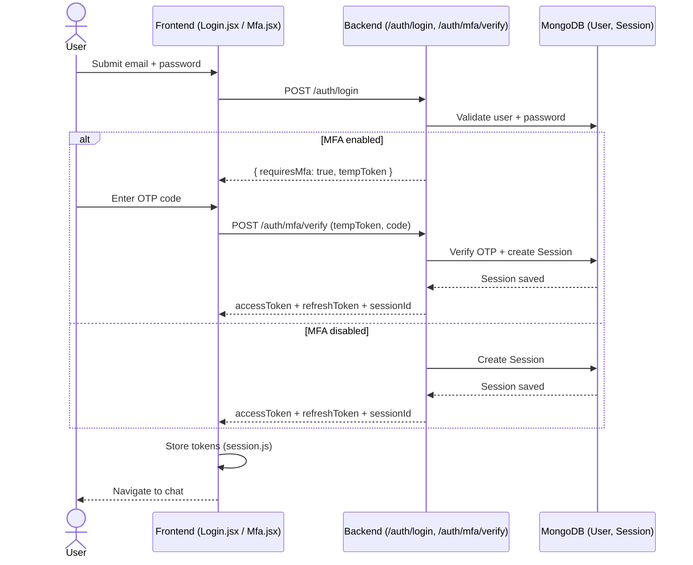

### 11.3 Token Refresh Flow (Sequence Diagram)
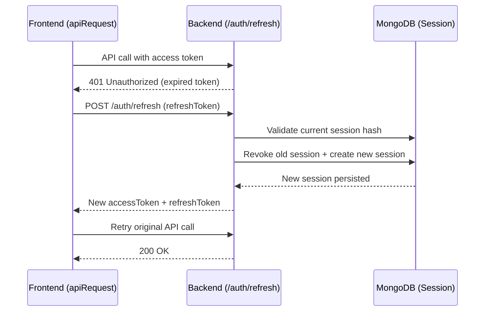

### 11.4 Message Send (Realtime) Flow (Sequence Diagram)
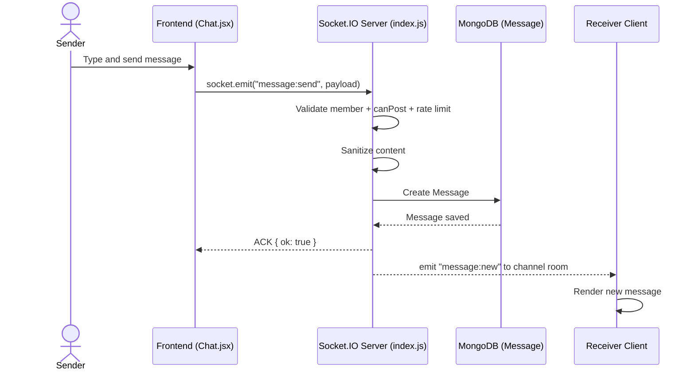

### 11.5 Group Join by Invite / Request (Sequence Diagram)
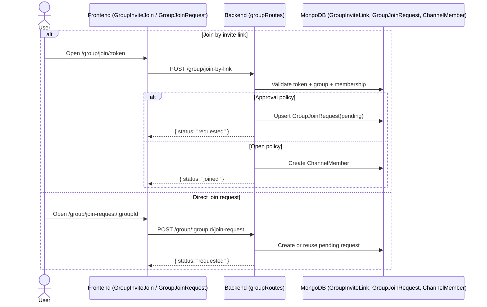

### 11.6 Story Create + Feed Flow (Sequence Diagram)
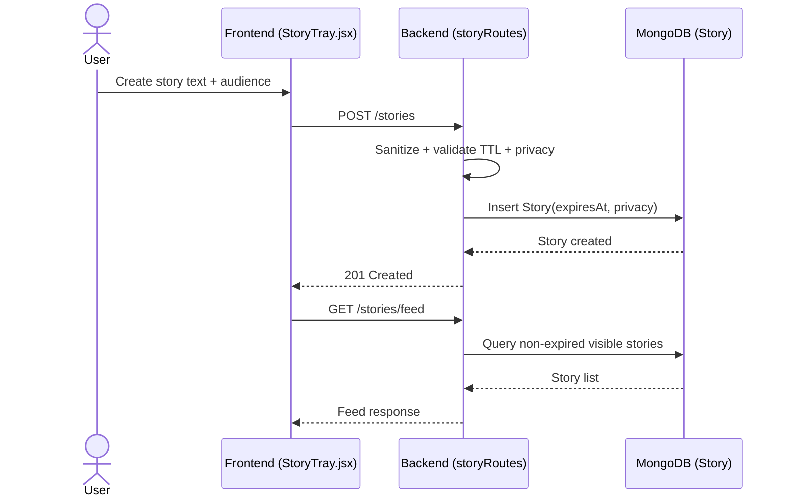

### 11.7 Notifications Flow (Sequence Diagram)
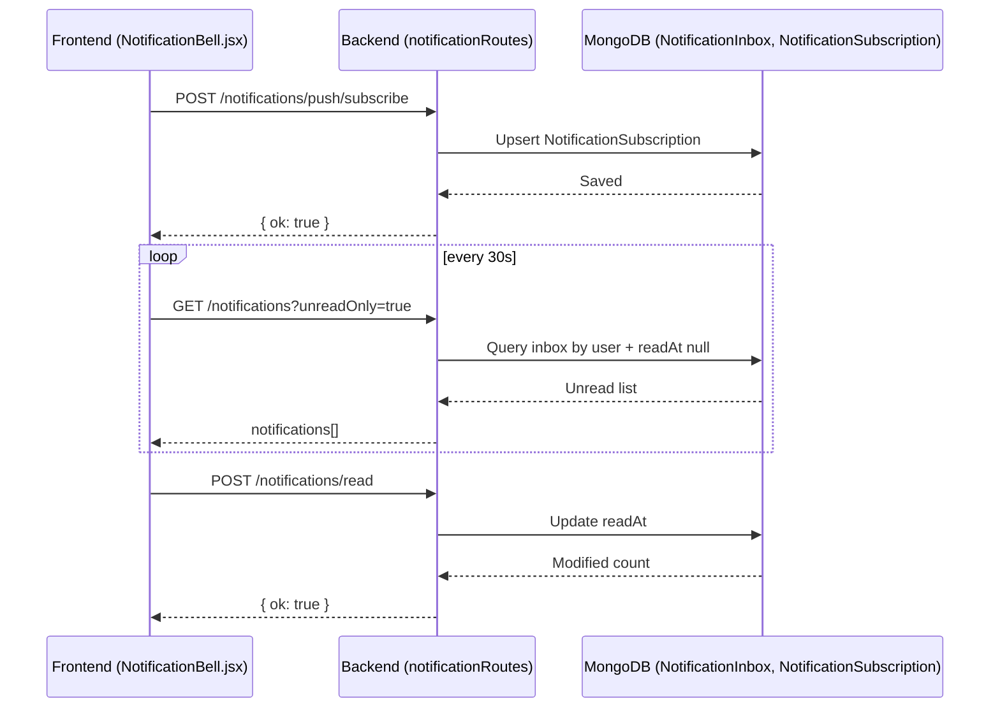

### 11.8 Call Invite + Signaling Flow (Sequence Diagram)
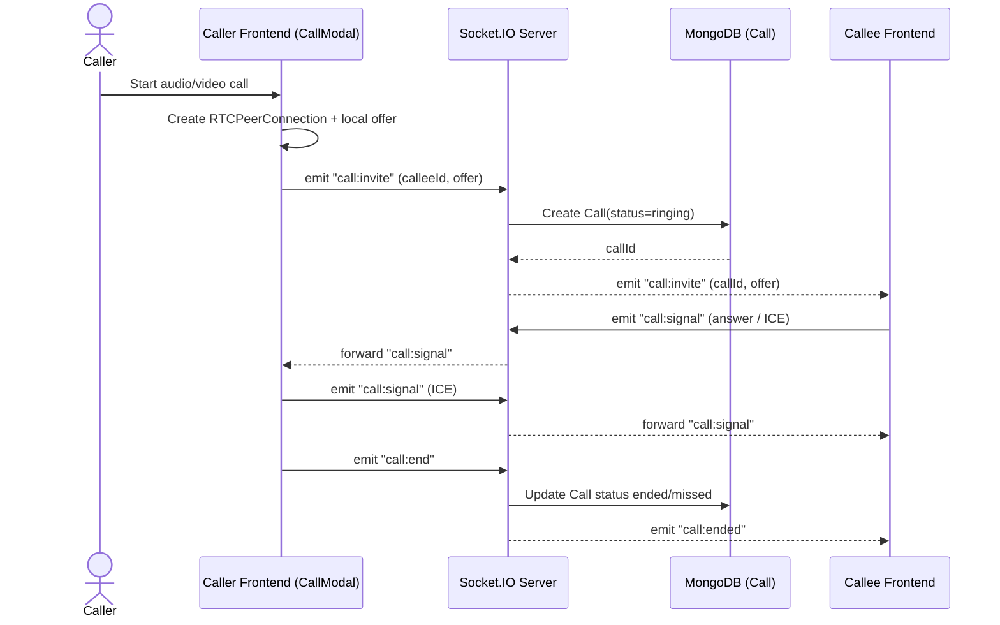

### 11.9 Linked Devices (Session Revoke) Flow (Sequence Diagram)
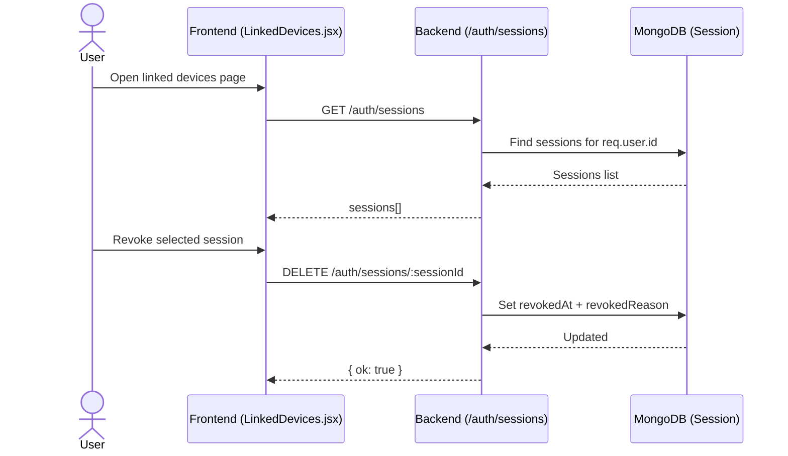

---

## 12. Pictorial UML Images (PNG)

### 12.1 Authentication (Signup + Signin + MFA)
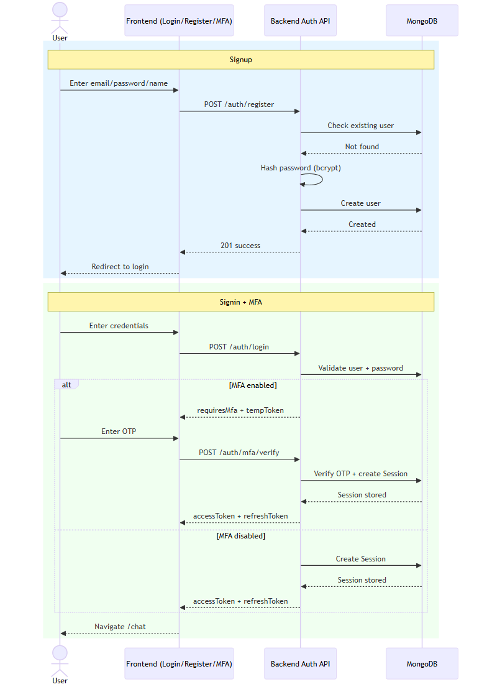

### 12.2 Realtime Messaging
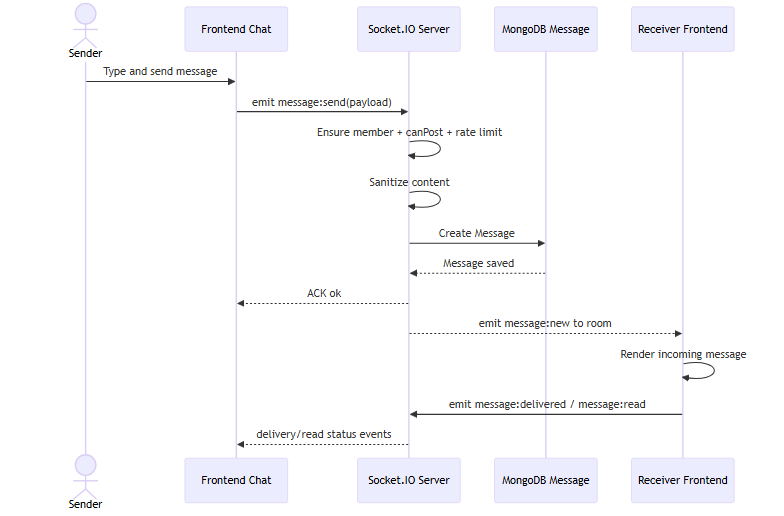

### 12.3 Group + Stories + Notifications
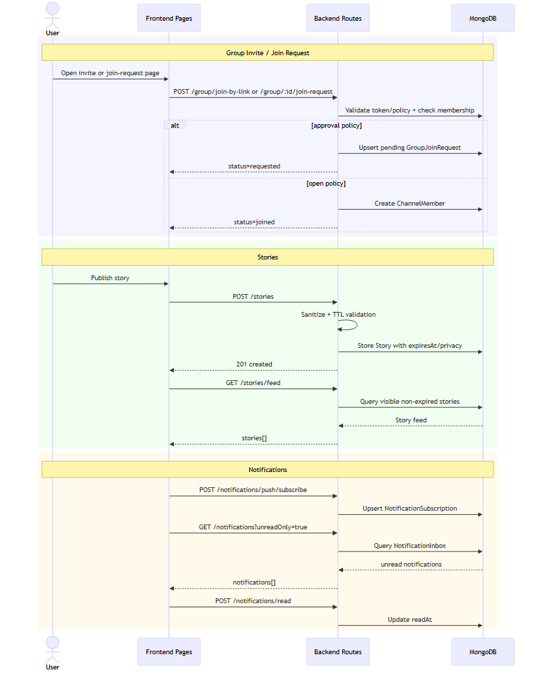

### 12.4 Calls + Linked Devices
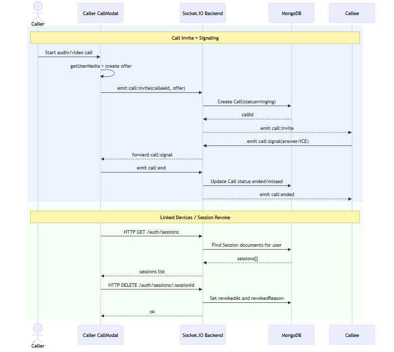

---

## 13. Pictorial Class Diagrams (PNG)

### 13.1 Auth + Session Domain
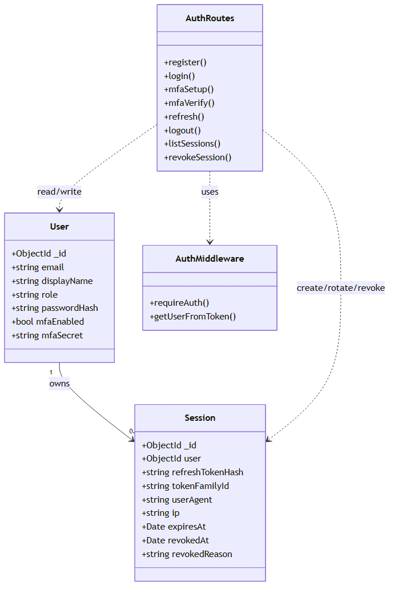

### 13.2 Messaging + Group Domain
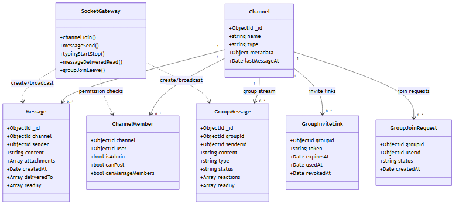

### 13.3 Story + Notification Domain
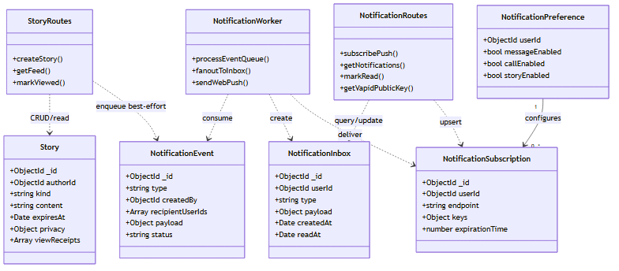

### 13.4 Calls + Admin + Devices Domain
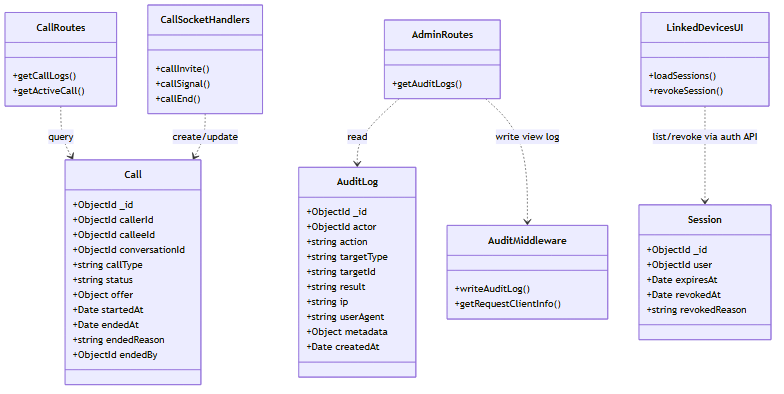

